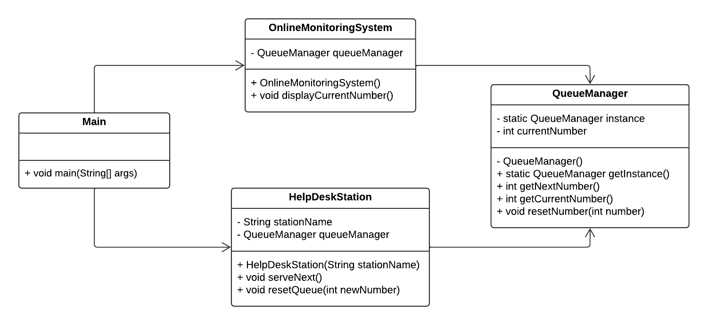

# Centralized Queuing System for Pag-ibig Office
The Pag-ibig office implements a centralized queuing system for three help desk stations. Individuals visiting the office obtain a queue number from this centralized system. Additionally, there's an online monitoring system that displays the current queued number in real-time for individuals monitoring the queue remotely.

Each help desk station has an option to reset the queuing number based on an inputted number, allowing flexibility in managing the queue during specific situations, such as reorganization or technical issues. This queuing system ensures a single centralized queue number for all help desk stations, while the reset option offers control and adjustment in exceptional circumstances.

This approach aims to maintain an organized queuing process for individuals visiting the office and provides the flexibility to handle queue adjustments as needed.

### Class Definitions
- **QueueManager (Singleton Class)** → Manages the centralized queuing system for the Pag-ibig office. Ensures that only one instance exists throughout the application. It maintains the current queue number, provides the next number through the `getNextNumber()` method, returns the current number using `getCurrentNumber()`, and allows resetting the queue with `resetNumber(number)`.
- **HelpDeskStation** → Represents an individual help desk counter in the Pag-ibig office. Each station connects to the shared `QueueManager` instance and serves clients by calling the `serveNext()` method. It can also reset the queue using the `resetQueue(newNumber)` method when needed.
- **OnlineMonitoringSystem** → Represents the online display system that shows the current queue number in real time. It accesses the same Singleton `QueueManager` instance and displays the number through the `displayCurrentNumber()` method.
- **Main** → The driver class of the program. Simulates the Pag-ibig queuing process by creating multiple help desk stations and the online monitoring system. It demonstrates how all components share the same `QueueManager` instance and work together to manage the centralized queue.

Below is the **UML Class Diagram** for this project:

